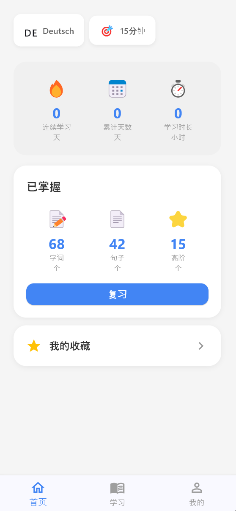
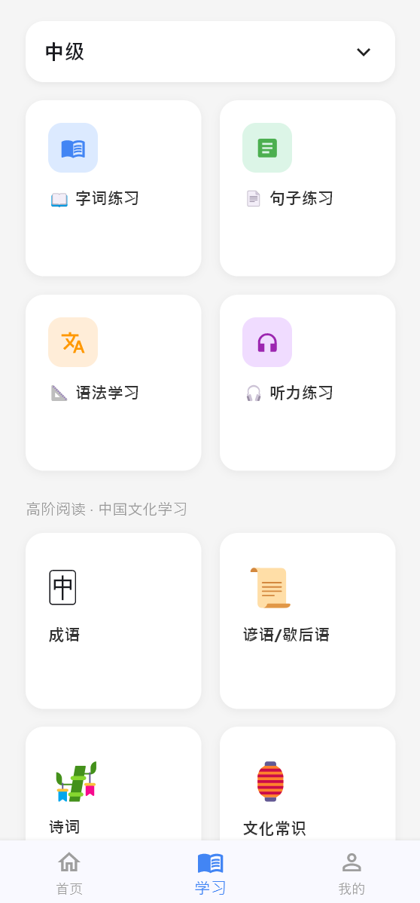
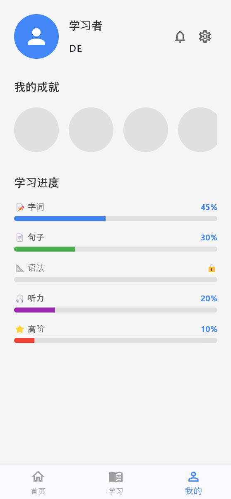

# 汉语通（Chinese Go）

> 面向外国人的中文学习 App，帮助学习者通过语音交互掌握中文词汇、成语与古诗词。

---

## 📖 项目介绍

**汉语通**是一款专为外国人设计的中文学习应用，核心特色：

- 🎧 **听词解义**：用户听到中文词/成语/古诗词，用自己的母语语音说出含义，AI 进行三维评分（字面义 / 引申义 / 现实应用）
- 🗣️ **发音评测**：朗读中文内容，AI 评测声调与发音准确度
- 📚 **分级学习体系**：
  - 入门（HSK 1–2）：基础字词、常用句型
  - 初级（HSK 3–4）：进阶词汇、语法
  - 中级（HSK 5–6）：复杂句式、惯用语
  - 高级：成语 / 谚语 / 歇后语 / 古诗词
- 🌍 **多语言界面**：支持英语、日语、韩语、西班牙语等 8 种母语

> 📌 **当前状态**：UI 原型阶段。录音与音频播放为占位实现（模拟 2 秒录音 + 随机评分），实际语音功能待接入 Whisper / flutter_tts 等 API。

---

## 🗂️ 项目结构

```
chinese_go_app_flutter/
├── pubspec.yaml               # 依赖配置
├── assets/
│   └── icon/
│       └── app_icon.png       # App 图标原图（1024×1024，蓝色渐变+「汉」字+音波）
└── lib/
    ├── main.dart              # 入口（含 Windows 窗口管理）
    ├── app_state.dart         # 全局状态（Provider + SharedPreferences）
    ├── router.dart            # 路由（go_router）
    ├── screens/
    │   ├── splash_screen.dart         启动页
    │   ├── language_selection.dart    选择母语（引导步骤 1）
    │   ├── level_test.dart            水平测试（引导步骤 2）
    │   ├── goal_setting.dart          学习目标（引导步骤 3）
    │   ├── main_layout.dart           底部导航框架
    │   ├── home_tab.dart              首页
    │   ├── learn_tab.dart             学习页
    │   ├── profile_tab.dart           我的页
    │   ├── practice_page.dart         字词 / 句子练习
    │   ├── advanced_practice.dart     高阶练习（成语 / 诗词等）
    │   ├── listening_practice.dart    听力练习
    │   ├── favorites_page.dart        我的收藏
    │   ├── review_page.dart           复习
    │   └── empty_page.dart            占位页（功能开发中）
    └── widgets/
        └── step_indicator.dart        步骤指示器（小圆点）
```

---

## 📷 界面展示

  

---

## 🔧 依赖说明

| 包 | 用途 |
|---|---|
| `provider` | 状态管理（对应 React Context） |
| `shared_preferences` | 本地持久化（对应 localStorage） |
| `go_router` | 页面路由（对应 react-router） |
| `window_manager` | Windows 桌面窗口大小 / 标题控制 |
| `flutter_launcher_icons` | 自动生成多分辨率 App 图标（mdpi / hdpi / xhdpi / xxhdpi / xxxhdpi） |

---

## 🚀 环境准备

### 第一步：安装 Flutter SDK

1. 访问 [https://docs.flutter.dev/get-started/install/windows](https://docs.flutter.dev/get-started/install/windows)
2. 下载并解压到 **`C:\flutter`**（⚠️ 不要放在 `C:\Program Files\`，会因权限报错）
3. 将 `C:\flutter\bin` 加入系统环境变量 `PATH`：
   - 按 `Win + R` → 输入 `sysdm.cpl` → 环境变量 → 系统变量 → 双击 `Path` → 新建 → 输入 `C:\flutter\bin` → 三次确定
4. 打开命令提示符，验证：
   ```
   flutter --version
   ```
   看到版本号即成功。

### 第二步：运行环境诊断

```
flutter doctor
```

如果出现 `Android licenses not accepted`，运行：

```
flutter doctor --android-licenses
```

全部输入 `y` 回车即可。

### 第三步：安装 Android Studio Flutter 插件

1. 打开 Android Studio → `Ctrl + Alt + S` → **Plugins** → **Marketplace**
2. 搜索 `Flutter` → Install（会自动安装 Dart 插件）
3. 重启 Android Studio

---

## ▶️ 运行项目

### 克隆 / 打开项目

```
git clone https://gitee.com/你的用户名/chinese-go-app.git
cd chinese-go-app
```

或在 Android Studio 中：**File → Open** → 选择项目文件夹。

### 安装依赖

```
flutter pub get
```

### 初始化平台支持（第一次运行必须做）

根据你要运行的平台，在 Terminal 中执行对应命令（**注意末尾的空格和点 `.`**）：

| 目标平台 | 命令 |
|---|---|
| Android 模拟器 / 真机 | `flutter create --platforms=android .` |
| Windows 桌面 | `flutter create --platforms=windows .` |
| iOS（需要 Mac + Xcode） | `flutter create --platforms=ios .` |
| 同时支持多个平台 | `flutter create --platforms=android,windows,ios .` |

> 这条命令会生成对应的原生目录（`android/` 或 `windows/`），不会覆盖已有代码，只需执行一次。

执行完后再运行：

```
flutter pub get
```

### 运行

**Android 模拟器**：
1. `Tools → Device Manager → + → Pixel 6 → API 34` 创建并启动模拟器
2. 顶部设备下拉框选 Pixel 6，点击 **▶ Run**

**Android 真机**：
1. 手机开启「开发者选项」：设置 → 关于手机 → 连续点击版本号 7 次
2. 打开「USB 调试」
3. 数据线连接电脑，手机弹窗点「允许」
4. 顶部下拉框选择你的手机，点击 **▶ Run**

**Windows 桌面**（无需模拟器，直接在电脑运行）：
```
flutter run -d windows
```
或顶部设备下拉框选 **Windows**，点击 **▶ Run**。窗口会自动以手机比例（390×844）居中打开。

> ⚠️ Windows 桌面运行需要安装 **Visual Studio 2022**，并勾选「使用 C++ 的桌面开发」工作负载。

**iOS 真机 / 模拟器**（需要 Mac + Xcode）：
```
flutter run -d ios
```
> ⚠️ iOS 编译必须在 **macOS** 上进行，Windows 无法编译 iOS。项目代码已包含 `ios/` 目录，在 Mac 上开启 Xcode 后即可直接运行。

**打包为 APK（通过 QQ / 微信发给手机安装）**：
```
flutter build apk --debug
```
APK 路径：`build\app\outputs\flutter-apk\app-debug.apk`

---

## 🔥 开发调试技巧

| 操作 | 快捷键 |
|---|---|
| 热重载（修改代码秒刷新） | `Ctrl + \` 或点击闪电 ⚡ |
| 热重启 | `Ctrl + Shift + \` |
| 停止运行 | `Ctrl + F2` |
| 查看日志 | 底部 **Logcat** 标签 |

---

## 🎨 App 图标

App 桌面图标为蓝色渐变背景 + 白色「汉」字 + 音波图案，已为 Android 和 iOS 所有屏幕密度自动生成。

**如需更换图标**：

1. 准备一张 **1024×1024 像素**的 PNG 图片，替换 `assets/icon/app_icon.png`
2. 在项目根目录执行：
   ```
   flutter pub run flutter_launcher_icons
   ```
3. 重新编译运行即可，所有分辨率会自动更新。

---

## 🛠️ 常见报错

| 报错 | 解决方法 |
|---|---|
| `flutter: command not found` | 检查 `C:\flutter\bin` 是否加入系统 Path，重启命令行 |
| `Android licenses not accepted` | 运行 `flutter doctor --android-licenses`，全部输入 `y` |
| `pub get` 网络超时 | 设置国内镜像：`set PUB_HOSTED_URL=https://pub.flutter-io.cn` 再重试 |
| `No Windows desktop project configured` | 运行 `flutter create --platforms=windows .` |
| `AndroidManifest.xml could not be found` | 运行 `flutter create --platforms=android .` |
| `Gradle build failed` | 网络问题，保持网络畅通耐心等待；或重试 |
| `minSdkVersion` 相关错误 | 打开 `android/app/build.gradle`，将 `minSdkVersion` 改为 `21` |

---

## 🤝 贡献指南

欢迎提交 PR 或 Issue！在贡献代码前，请阅读以下规范：

### 分支命名规范

```
feature/功能描述      # 新功能，如 feature/whisper-integration
fix/问题描述          # Bug 修复，如 fix/splash-screen-crash
refactor/重构描述     # 代码重构
docs/文档更新         # 仅修改文档
```

### 提交信息规范（Commit Message）

使用中文 + 类型前缀：

```
feat: 新增 Whisper 语音识别接入
fix: 修复首页统计数字不更新的问题
refactor: 重构 AppState 状态管理逻辑
docs: 更新 README 安装步骤
style: 统一代码缩进格式
```

### 代码规范

- 所有新文件使用 **Dart 规范命名**（小写 + 下划线，如 `my_widget.dart`）
- 类名使用大驼峰（`PracticeCard`）
- 私有变量以 `_` 开头（`_isLoading`）
- 避免在 Widget `build()` 方法中写业务逻辑，提取到 `AppState` 或单独的 Service 类
- 提交前运行 `flutter analyze` 确保无 lint 错误

### 提交流程

1. Fork 本仓库
2. 创建你的功能分支：`git checkout -b feature/你的功能`
3. 提交改动：`git commit -m "feat: 描述你的改动"`
4. 推送到远程：`git push origin feature/你的功能`
5. 在 Gitee 上发起 **Pull Request**，描述你的改动内容

### 优先贡献方向

目前项目最需要以下方向的贡献：

- [ ] **语音录音**：接入 `record` 包，实现真实录音并上传
- [ ] **TTS 播放**：接入 `flutter_tts`，实现中文朗读
- [ ] **语音评分后端**：接入 Whisper large-v3 或科大讯飞 API
- [ ] **词汇数据库**：使用 `sqflite` 本地存储 HSK 词汇及成语数据
- [ ] **多语言 i18n**：接入 `flutter_localizations` + `intl` 包
- [ ] **单元测试**：为 `AppState` 和路由逻辑补充测试用例

---

## 📄 License

MIT License — 欢迎自由使用和修改，保留原作者信息即可。
